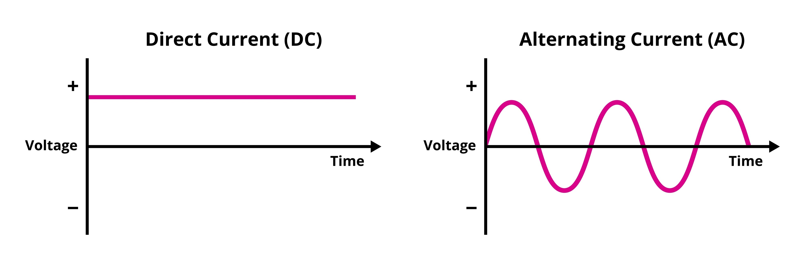

# Introducción a la Electricidad y Leyes Fundamentales

## Ley de Ohm y Potencia

### Ley de Ohm

La intensidad de corriente que circula por un circuito es directamente proporcional a la tensión aplicada e inversamente proporcional a su resistencia.

  

**I (Intensidad de corriente):** Es el flujo de electrones que circula por el conductor. Se mide en Amperes (A).

$$I = \frac{V}{R}$$

Para pasar de A a mA se multiplica por 1000 ($1\text{ A} = 1000\text{ mA}$); para pasar de mA a A se divide por 1000.

**V (Tensión o Voltaje):** Es la fuerza que impulsa a los electrones (la corriente) a través del circuito. Se mide en Volts (V).

$$V = R \cdot I$$

**R (Resistencia):** Es la dificultad u oposición que presenta el material al paso de la corriente eléctrica. Se mide en Ohms ($\Omega$).

$$R = \frac{V}{I}$$

### Analogía hidráulica

Para entender el comportamiento, imagina un circuito como una manguera: la tensión es la presión del agua, la intensidad es el caudal que circula y la resistencia es lo angosta que está la manguera. Por ende, a más presión (más voltaje) habrá más caudal (más corriente); pero si la manguera se estrangula (más resistencia), pasará menos caudal (menos corriente).

### Potencia eléctrica en corriente continua

Es la cantidad de energía transferida por una fuente a un circuito por unidad de tiempo. Por el principio de conservación de la energía, esta energía no se pierde, sino que se transforma en otra manifestation energética.

  

**P (Potencia):** Es la cantidad de energía transferida o transformada. Se mide en Watts (W).

$$P = V \cdot I$$

**V (Tensión o Voltaje):** Es la tensión aplicada al circuito. Se mide en Volts (V).

$$V = \frac{P}{I}$$

**I (Intensidad de corriente):** Es la corriente que circula por el circuito. Se mide en Amperes (A).

$$I = \frac{P}{V}$$

### Explicación del desfase (Por qué se usa esa fórmula)

La fórmula general real de la potencia incluye el desfasaje entre la tensión y la corriente, y es:

$$P = V \cdot I \cdot \cos(\varphi)$$

Sin embargo, en Corriente Continua (CC) ese desfasaje es de $0^{\circ}$. Como el coseno de 0 grados es igual a 1, la fórmula se simplifica directamente a

$$P = V \cdot I$$

---

## Corriente Continua (CC) vs. Corriente Alterna (CA)

Antes de pasar al análisis de los circuitos, es importante conocer la diferencia entre los dos tipos de corriente con los que trabajan los componentes:

### 1. Corriente Continua (CC / DC)

Es aquella en la que los electrones viajan **siempre en la misma dirección** y en fila india a través del cable. Esto pasa porque los polos de la fuente (positivo y negativo) son fijos.

- **Ejemplo práctico:** Es la corriente que viene de las pilas, las baterías y la que usa internamente tu celular o la computadora.

### 2. Corriente Alterna (CA / AC)

Es aquella en la que los electrones no viajan de un punto a otro, sino que **van y vienen constantemente (oscilan)** dentro del cable. Esto ocurre porque la polaridad de la fuente cambia de sentido todo el tiempo (en Argentina, cambia 50 veces por segundo).

- **Ejemplo práctico:** Es la corriente que llega a los enchufes de nuestras casas y la que transportan los cables de alta tensión en la calle.

  

---

### Cuadro comparativo rápido

| Característica    | Corriente Continua (CC)              | Corriente Alterna (CA)                        |
| :---------------- | :----------------------------------- | :-------------------------------------------- |
| **Movimiento**    | En un solo sentido (línea recta)     | Van y vienen todo el tiempo (onda)            |
| **Polos (+ / -)** | Fijos (no cambian nunca)             | Variables (cambian constantemente)            |
| **Dónde se usa**  | Pilas, baterías, electrónica interna | Enchufes del hogar, red eléctrica de la calle |

---

## Concepto y Análisis de Circuitos

**Circuito Eléctrico:** Es un conjunto de elementos o componentes interconectados (como resistencias, diodos, capacitores, bobinas o pilas) de tal forma que debe haber, al menos, una trayectoria cerrada.

- **Condición de funcionamiento:** El conductor debe formar una trayectoria cerrada para que los electrones puedan fluir. Si se conecta un cable a los dos terminales de una pila, la corriente fluye porque el camino está cerrado (como una pista de carreras completa). Si sólo se conecta un extremo, no hay corriente porque los electrones no tienen hacia dónde ir (como una pista en construcción).
- **Peligro de cortocircuito:** No se debe conectar un alambre directo entre los terminales de una fuente. Como la resistencia es muy baja, se generará una gran corriente que calentará el cable y la pila, corriendo el riesgo de dañar la fuente. Para aprovechar la corriente, siempre se deben incluir componentes que interactúen con ella.

**Nodos:** Se llama nodo al punto de interconexión donde se unen dos o más componentes.

- **Regla de análisis para los Nodos:** Si dos puntos están unidos por conductores perfectos (cables limpios sin ningún componente en el medio), en teoría representan un solo y único punto en el circuito. Considerar que son dos nodos diferentes es un error común; aunque el dibujo cambie la forma de la conexión y los muestre separados, son en realidad un solo punto.

  

### Circuito eléctrico con resistencias en serie

Las resistencias están conectadas una a continuación de la otra en el circuito eléctrico, de tal forma que la corriente que atraviesa la primera de ellas será la misma que atraviesa las siguientes.

  

- **$I_t$:** La corriente total es igual en todos los componentes del circuito.
  $$I_t = I_1 = I_2 = \dots = I_n$$
- **$V_t$:** La tensión de la fuente, voltaje total, se reparte entre todas las resistencias.
  $$V_t = V_1 + V_2 + \dots + V_n$$
- **$R_t$:** La resistencia total es la suma directa de los valores de todas las resistencias.
  $$R_t = R_1 + R_2 + \dots + R_n$$

---

### Circuito eléctrico con resistencias en paralelo

Las resistencias están conectadas de tal forma que sus terminales de entrada están unidos entre sí, y sus terminales de salida también, quedando todas conectadas directamente a los mismos dos nodos del circuito.

  

- **$I_t$:** La corriente total se divide entre todos los caminos en paralelo.
  $$I_t = I_1 + I_2 + \dots + I_n$$
- **$V_t$:** El voltaje total es exactamente el mismo en cada una de las resistencias, ya que todas comparten los mismos nodos.
  $$V_t = V_1 = V_2 = \dots = V_n$$
- **$R_t$:** La inversa de la resistencia total es igual a la suma de las inversas de cada una de las resistencias.
  $$\frac{1}{R_t} = \frac{1}{R_1} + \frac{1}{R_2} + \dots + \frac{1}{R_n}$$

O despejada como una sola fracción:

$$R_t = \frac{1}{\frac{1}{R_1} + \frac{1}{R_2} + \dots + \frac{1}{R_n}}$$

---

## Leyes Fundamentales de Circuitos

### Ley de Kirchhoff (Ley de Nodos)

La sumatoria de las corrientes eléctricas que entran y salen de un nodo, dando signo positivo (+) a las que entran y signo negativo (-) a las que salen, es igual a 0 en todo instante de tiempo.

$$\sum_{k=1}^{n} I_k = 0 \Longleftrightarrow \sum I_{\text{entrada}} = \sum I_{\text{salida}}$$

$$I_{\text{entrada}} - I_{\text{salida}1} - I_{\text{salida}2} - \dots - I_{\text{salida}n} = 0 \Longleftrightarrow I_{\text{entrada}} = I_{\text{salida}1} + I_{\text{salida}2} + \dots + I_{\text{salida}n}$$

  

### Ley de Kirchhoff (Ley de Mallas)

La sumatoria de las tensiones a lo largo de un circuito cerrado (malla), dando signo positivo (+) a las subidas de tensión y signo negativo (-) a las caídas de potencial, es igual a 0 en todo instante de tiempo. Esto equivale a decir que la suma de las caídas de potencial es igual a la tensión (fuerza electromotriz) aplicada al mismo.

$$\sum_{k=1}^{n} V_{k}=0 \Longleftrightarrow \sum V_{\text{subidas}} = \sum V_{\text{caidas}}$$

$$V_{\text{total}} - V_1 - V_2 - \dots - V_n = 0 \Longleftrightarrow V_{\text{total}} = V_1 + V_2 + \dots + V_n$$

  

---

## Componentes Pasivos en Corriente Continua

Un **componente pasivo** es aquel que no genera energía por sí mismo. Su único trabajo es **reaccionar** a la corriente que le llega de la fuente: según el componente, puede frenarla, consumiéndola, o almacenándola un ratito para usarla después.

### Condensador o Capacitor

Son componentes que tienen ciertas particularidades especiales. Están compuestos por 2 placas metálicas enfrentadas separadas por un aislante (puede ser mica, el aire, cerámica, etc.) llamado dieléctrico. Tienen la capacidad de almacenar cargas cuando están conectados en un circuito eléctrico de corriente continua.

Se lo identifica con la letra **C**, su característica de almacenar cargas se llama **Capacidad** y se mide en **Faradios (F)**.

**Su símbolo:**

  

### Comportamiento de un condensador en corriente continua

  

  

Como se visualiza en el gráfico, la tensión sobre el condensador sube lentamente hasta alcanzar un valor máximo.

- **Analogía hidráulica:** Para entender el comportamiento, imaginate que un capacitor es como un tanque de agua intercalado en la cañería. Al principio, el tanque está vacío y el agua empieza a entrar llenándolo lentamente. A medida que el tanque se va llenando, la presión en el tanque sube despacito hasta que se iguala con la de la red; en ese momento, el tanque se llenó por completo y el agua deja de circular (bloquea el paso de la corriente).

---

### Inductores

También llamados comúnmente bobinas, son elementos eléctricos formados por un conductor arrollado sobre un núcleo no conductor.

**Su símbolo:**

  

Su comportamiento en corriente continua es acumular energía en forma de corriente eléctrica y una característica muy importante es generar un campo magnético a su alrededor proporcional a la corriente que lo atraviesa. Cuando se quiere quitar esa corriente el inductor responde generando una tensión igual pero de sentido inverso a la que producía la corriente que lo atravesaba. Esta tensión se denomina fuerza contraelectromotriz inducida (Fem). Su valor se mide en **Henrios o Henry** y se lo abrevia con **(H)** o **(Hy)**.

Al decir que genera un campo magnético a su alrededor proporcional al flujo eléctrico que lo atraviesa, se quiere decir que si se le aplica corriente continua, generará un campo magnético continuo.

### Comportamiento de un inductor en corriente continua

  

  

Aquí se puede ver que en un primer instante la tensión crece bruscamente sobre el inductor y luego baja hasta tender a 0 Volts (en un conductor ideal).

- **Analogía hidráulica:** Para entender el inductor, imaginate una rueda de paletas pesada (un molino) metida adentro de la tubería. Al principio, cuando el agua empieza a correr, la rueda está totalmente quieta y ofrece muchísima resistencia para empezar a girar, provocando un gran frenazo de golpe (el pico brusco de tensión). A medida que el agua empuja, la rueda empieza a girar más y más rápido hasta que acompaña el flujo por completo; en ese punto, la rueda ya no frena nada el agua y gira libremente sin oponer resistencia (la tensión cae a 0 Volts).

---

# CORRIENTE ALTERNA Y FILTROS

## Fundamentos de Corriente Alterna

### Corriente Alterna

El gráfico cartesiano para definir una tensión o una corriente constante es el siguiente:

  

Donde en A se lleva el valor de la tensión o de la corriente, t es el tiempo que transcurre y magnitud el valor medido en la unidad correspondiente. Se puede ver que la amplitud no varía. Una tensión o corriente continua es aquella que no cambia de signo a través del tiempo. El gráfico de la Fig 1 corresponde a esta definición. Pero los siguientes gráficos también:

  

  

El gráfico de la Fig. 2 respeta la definición. No cambia de signo, es negativa. El gráfico de la Fig 3 también la respeta. No cambia de signo.

Al de la las Fig. 1 y 2 se los denomina **tensión o corriente continua pura**. Al de la Fig 3 se lo denomina **tensión o corriente continua pulsante**. Pero los 3 son de tensión o corriente continua.

Otro caso es el de la Corriente Alterna. Normalmente llamada así, pero se refiere tanto a corriente como a tensión alterna. En este caso el sentido de circulación de la corriente o la aplicación de la tensión cambia de signo:

  

En este caso se ve que el valor de la tensión o corriente cambia de signo. O sea que en un momento la corriente circulará en un sentido y luego en otro, lo cual se refleja en el eje del tiempo.

El caso específico que estudiaremos en esta materia es el de la **corriente alterna senoidal o sinusoidal**. El gráfico puede verse en la siguiente figura:

  

Esta forma de onda surge del círculo trigonométrico donde se reflejan las variaciones de amplitud a través del tiempo que toma la amplitud al ser recorrida y reflejada en un gráfico cartesiano:

  

### Propiedades de la Onda Senoidal

Esta onda de tensión y corriente tienen algunas propiedades, algunas de las cuales definiremos a continuación:

- **Ciclo:** Es el recorrido entre dos puntos iguales de la onda. Se lo enuncia con la letra **c**.
- **Período:** Es el tiempo que se tarda en realizar un ciclo. Se mide en segundos (s) and se enuncia con la letra **T**.
- **Frecuencia:** Es la cantidad de ciclos que se realizan por segundo. Se mide en Hertz (Hz). Un Ciclo por Segundo equivale a 1 Hz. Se la enuncia con la letra **f**.

En el siguiente gráfico se reflejan estas 3 definiciones: En el caso de la Fig. 7, en verde se ve un Ciclo, y el tiempo que tarda en realizarse ($T = \text{período}$) es un segundo. Por lo tanto la Frecuencia es de 1 ciclo por segundo o lo que es lo mismo 1 Hz (Hz).

  

**Fórmulas:**

$$T = \frac{1}{f}$$

$$f = \frac{1}{T}$$

---

## Comportamiento de Componentes en Alterna

Cuando pasamos a corriente alterna, las cosas cambian. Como la corriente va y viene todo el tiempo, los capacitores y las bobinas empiezan a ofrecer una oposición al paso de esta señal. Esta "resistencia" especial en alterna se llama **Reactancia**.

A diferencia de una resistencia común (que siempre frena la corriente por igual), la reactancia depende de la **frecuencia** de la onda (es decir, de qué tan rápido vaya y venga la corriente).

### Reactancia Capacitiva ($X_c$)

Es la "resistencia" que presenta un condensador al paso de la corriente alterna. Se mide en Ohms ($\Omega$). Su fórmula es:

$$|X_C| = \frac{1}{2\pi f C}$$

Donde **f** es la frecuencia en Hertz (Hz) del generador y **C** es el valor del condensador en Faradios (F). Es una magnitud vectorial a $90^{\circ}$ con respecto al eje X.

- **Analogía hidráulica:** Para entender cómo funciona, imaginate al capacitor como un tanque de agua con una membrana elástica en el medio. Si la corriente va y viene súper rápido (alta frecuencia), el agua empuja hacia un lado, la membrana apenas se estira y enseguida el agua vuelve, fluyendo casi sin frenarse (**baja reactancia**). Pero si la corriente va muy lento (baja frecuencia), el agua empuja mucho tiempo para el mismo lado, la membrana se estira al máximo y se traba, bloqueando el paso (**alta reactancia**).

### Reactancia Inductiva ($X_L$)

Es la "resistencia" que presenta un inductor al paso de la corriente alterna. Se mide en Ohms ($\Omega$). Su fórmula es:

$$|X_L| = 2\pi f L$$

Donde **f** es la frecuencia en Hertz (Hz) del generador y **L** es el valor del inductor en Henrios (H). Es una magnitud vectorial a $90^{\circ}$ en sentido opuesto a $X_c$ _(Nota: La resistencia R en corriente alterna se comporta igual que en continua y su ángulo es $0°$ sobre el eje X)._

- **Analogía hidráulica:** Para entender cómo funciona, imaginate a la bobina como una rueda de paletas muy pesada metida adentro del caño. Si la corriente va y viene súper rápido (alta frecuencia), el agua intenta ir para un lado y la rueda pesada la frena; cuando quiere empezar a girar, el agua ya cambió de dirección y la vuelve a frenar, por lo que casi no se mueve (**alta reactancia**). Si la corriente va lento (baja frecuencia), el agua empuja un buen rato, logra hacer girar la rueda y pasa casi sin enterarse (**baja reactancia**).

### Esquema Gráfico de Resistencias

Gráficamente, $R$, $X_C$ y $X_L$ tienen distinta orientación sobre los ejes. Usando a $R$ como referencia a $0^{\circ}$ sobre el eje X, se dibuja a $X_L$ a $90^{\circ}$ hacia arriba y a $X_C$ a $90^{\circ}$ en sentido opuesto (hacia abajo).

#### Resistencia (R):

  

- La Resistencia se dibuja siempre acostada, apuntando hacia la derecha (a $0^\circ$), porque la corriente alterna no desvía su dirección. Se queda firme en la horizontal.

#### Reactancia Capacitiva ($X_C$):

  

- La fuerza del capacitor apunta directo hacia abajo (a $90^\circ$ en sentido negativo), empujando la señal verticalmente hacia el fondo del mapa.

#### Reactancia Inductiva ($X_L$):

  

- La fuerza de la bobina apunta directo hacia arriba (a $90^\circ$ en sentido positivo), yendo exactamente para el lado contrario que el capacitor.

### Desfasaje en Corriente Alterna

Es el ángulo de separación que se produce entre las ondas de tensión y de corriente al atravesar un componente.

**Símbolo del generador:**

  

- El desfasaje representa la falta de sincronización o la "demora" en el tiempo entre la Tensión (el empuje) y la Corriente (el flujo). Mientras que en una resistencia viajan juntas al mismo tiempo, las bobinas y los capacitores hacen que una de las ondas se retrase o se adelante respecto a la otra, y esa diferencia se mide en grados.

1. **Circuito totalmente resistivo:** La corriente sigue la misma forma de onda que la tensión, por lo que se dice que están en fase. Su corriente es:

$$I = \frac{V}{R}$$

  

   

  

- En un circuito resistivo puro, la tensión y la corriente viajan perfectamente sincronizadas y al mismo tiempo. Al no haber demoras, se dice que están "en fase" (desfasaje de $0^\circ$).

2. **Circuito totalmente inductivo:** Las ondas se separan y se dice que la tensión adelanta a la corriente en $90^{\circ}$. Su corriente es:

   $$I = \frac{V}{X_L}$$

  

  

- Debido a que la bobina se opone a los cambios bruscos de corriente, esta se retrasa un cuarto de vuelta ($90^\circ$) respecto a la tensión. La fuerza empuja primero, pero el flujo de corriente se mueve más tarde.

3. **Circuito totalmente capacitivo:** Las ondas se separan y se dice que la tensión atrasa a la corriente en $90^{\circ}$. Su corriente es:

$$I = \frac{V}{X_C}$$

  

  

- Como el capacitor vacío absorbe corriente a los piques para cargarse, el flujo de corriente se adelanta un cuarto de vuelta ($90^\circ$) respecto a la tensión. La corriente circula primero, y la fuerza de la tensión en el tanque aparece después.

---

# CIRCUITOS COMPLEJOS Y RESONANCIA

- En esta sección se estudia qué ocurre cuando combinamos la Resistencia, la Bobina y el Capacitor en un mismo circuito, donde sus efectos individuales se mezclan. Además, se analiza el fenómeno de "Resonancia", un estado especial en el que la bobina y el capacitor anulan sus fuerzas mutuamente, permitiendo el máximo paso de corriente.

## Circuito RLC Serie

- Un circuito RLC serie es simplemente una conexión donde una Resistencia ($R$), una Bobina ($L$) y un Capacitor ($C$) se colocan en fila, uno detrás del otro. En este tipo de circuito, la corriente no tiene caminos alternativos: está obligada a pasar por los tres componentes en orden, haciendo que sus efectos se combinen y compitan entre sí.

### Pulsación ($\omega$)

En las fórmulas de reactancia figura el término $2\pi f$. A esto se lo llama **pulsación**, se identifica con la letra griega omega ($\omega$) y su unidad es radianes por segundo (rad/s). Permite simplificar las fórmulas anteriores de la siguiente manera:

$$\omega = 2\pi f \Longrightarrow |X_C| = \frac{1}{\omega C} \quad \text{y} \quad |X_L| = \omega L$$

- La pulsación ($\omega$) funciona como un atajo matemático que agrupa el término $2\pi f$ en una sola letra. En lugar de contar vueltas completas por segundo (Hertz), mide la velocidad de giro en radianes por segundo, lo que permite simplificar visualmente las fórmulas de las reactancias.

### Definición de Impedancia ($Z$)

Es la resistencia total que un circuito RLC serie presenta al paso de la corriente alterna. Se mide en Ohms ($\Omega$). Al estar los componentes en serie, sus resistencias deben sumarse, pero por ser vectores la suma tiene que ser de forma vectorial (posee módulo y argumento o ángulo $\rho$).

  

- La Impedancia ($Z$) representa el freno total del circuito combinado. No es una suma matemática común porque incluye fuerzas que tiran en distintas direcciones (vectores), por lo que se representa como una diagonal en un plano de dos ejes.

### Suma Geométrica (Gráfica)

Como $X_C$ y $X_L$ están sobre la misma recta de acción pero en sentidos opuestos, primero se restan directamente ($X_L - X_C$). El vector resultante de esa resta se combina a $90^{\circ}$ con la resistencia $R$ para formar la Impedancia ($Z$) y su ángulo de desfasaje ($\rho$).

  

  

- En los gráficos se ve cómo la bobina y el capacitor se canibalizan verticalmente al estar en sentidos opuestos. La diferencia que queda de esa resta se une con la resistencia horizontal, dando origen a la diagonal que es la Impedancia ($Z$) y al ángulo de desfasaje final.

### Suma Analítica (Fórmulas)

- **Módulo de la Impedancia:**
  $$|Z| = \sqrt{R^2 + (X_L - X_C)^2}$$

  $$|Z| = \sqrt{R^2 + \left(2\pi f L - \frac{1}{2\pi f C}\right)^2}$$

- **Ángulo de desfasaje:**
  $$\tan(\rho) = \frac{X_L - X_C}{R} \Longrightarrow \rho = \arctan\left(\frac{X_L - X_C}{R}\right)$$

* Estas fórmulas aplican el Teorema de Pitágoras para calcular numéricamente la diagonal de la Impedancia ($Z$) y usan trigonometría ($\arctan$) para averiguar cuántos grados se desvió la señal (el ángulo de desfasaje $\rho$) debido al efecto combinado de los componentes.

---

## Frecuencia de Resonancia ($f_0$)

Como $X_L$ y $X_C$ se restan en la fórmula, cuando sus valores sean iguales se anularán entre sí ($X_L = X_C$). Cuando esto ocurre, la impedancia vale únicamente el valor de la resistencia ($Z = R$).

Esto se da a una determinada frecuencia llamada **frecuencia de resonancia ($f_0$)**, medida en Hertz (Hz), y tiene la particularidad de que en ese instante la corriente por el circuito será máxima.

Su fórmula es:

$$f_0 = \frac{1}{2\pi \sqrt{L \cdot C}}$$

- En el estado de resonancia, la bobina y el capacitor empatan sus fuerzas y se anulan por completo entre sí. Al desaparecer su freno, la Impedancia ($Z$) cae a su valor mínimo posible (igual al de la resistencia) y la corriente del circuito se dispara a su punto máximo.

## Aplicaciones Técnicas: Filtros

### Filtros

Son circuitos compuestos por componentes pasivos (resistencias, condensadores e inductores) que tienen características selectivas de señales. Esto significa que, según cómo se combinen, permiten el paso de ciertas frecuencias y bloquean otras.

Convengamos a modo de estudio que Rx será el receptor (y cumplirá la función de R) y G será Tx (y cumplirá la función del transmisor).

- Para entender el mapa: **G (o Tx)** es el **Transmisor**, que funciona como el origen o el "Generador" que manda la señal de radio, música o datos por el cable. **Rx** es el **Receptor**, que es el aparato del otro lado (como un parlante o un televisor) encargado de recibir esa señal. Los filtros se meten en el medio de los dos para limpiar el camino.

### 1. Circuito Pasa Altos

Presentará una baja resistencia a las frecuencias altas en un circuito. Se logra conectando un condensador en serie entre el transmisor y el receptor.

  

Recordemos la fórmula de $X_C$:

$$X_C = \frac{1}{2\pi f C}$$

Por lo tanto, si $f$ sube, $X_C$ baja y por las leyes vistas la corriente será superior por el circuito y la potencia sobre Rx será mayor.

Por el contrario, si la frecuencia $f$ baja, la reactancia sube y si $f$ tiende a 0, $X_C$ tiende a infinito, lo que significa que se comporta como un circuito abierto. No dejando pasar la señal.

  

El gráfico muestra la distribución de la potencia de la señal que recibe el receptor a medida
que la frecuencia aumenta. fci es la frecuencia de corte inferior. Es la frecuencia a partir de la
cual la potencia sobre Rx será mayor.

- **Analogía de funcionamiento (Mecánica):** Este circuito se comporta de manera similar a un colador de cocina. Las frecuencias altas se asemejan a partículas muy finas que atraviesan los agujeros sin encontrar resistencia, logrando pasar de largo. En cambio, las frecuencias bajas actúan como elementos gruesos que se topan con una pared cerrada (circuito abierto) y quedan bloqueados en la entrada.
- **Analogía de funcionamiento (Hidráulica):** También se puede comparar con una tubería de agua que tiene una compuerta pesada sostenida por un resorte fuerte. Si el agua viene a los piques, con golpes rápidos y con mucha fuerza (alta frecuencia), logra empujar la compuerta y el agua pasa de largo. Pero si el agua viene despacio, lenta y sin fuerza (baja frecuencia), el resorte mantiene la compuerta cerrada y corta el paso por completo.
- **Conclusión del circuito:** En definitiva, el circuito Pasa Altos utiliza la reactancia del capacitor para controlar el camino de la señal. Al ofrecer una resistencia inversamente proporcional a la frecuencia, se asegura de limpiar las bajas frecuencias no deseadas, garantizando que solo las señales que superan con éxito la frecuencia de corte inferior ($f_{ci}$) tengan la vía libre para alimentar al receptor con su máxima potencia.

---

### 2. Circuito Pasa Bajos

Presentara una baja resistencia a las frecuencias bajas en un circuito. Se logra conectando un inductor en serie entre el transmisor y el receptor.

  

Recordemos la fórmula de $X_L$:

$$X_L = 2\pi f L$$

Por lo tanto, si la frecuencia $f$ es baja, el valor de la reactancia inductiva será muy bajo, casi no oponiendo resistencia al paso de la corriente eléctrica.

Por el contrario, si la frecuencia $f$ sube, el valor de la reactancia inductiva subirá en forma proporcional, llegando a valores muy altos donde se comportará como una gran resistencia no dejando pasar la señal.

  

El gráfico muestra la distribución de la potencia de la señal que recibe el receptor a medida que la frecuencia aumenta, cayendo la potencia cuando se supera la frecuencia de corte.

- **Analogía de funcionamiento (Mecánica):** En este caso, el circuito actúa de forma similar a un clasificador de piedras o rejilla de desagüe. Las frecuencias bajas son como partículas pequeñas o agua fluida que pasan a través de las rejillas sin ningún problema. En cambio, las frecuencias altas actúan como piedras grandes y pesadas que se amontonan tapando la entrada, quedando completamente bloqueadas.
- **Analogía de funcionamiento (Hidráulica):** También se puede pensar como una tubería que tiene una compuerta pesada con un sistema de amortiguación. Si el agua empuja de forma suave, constante y lenta (baja frecuencia), la compuerta se abre gradualmente y la deja pasar de largo. Pero si el agua viene con golpes bruscos, rápidos y caóticos (alta frecuencia), el mecanismo se frena en seco por el impacto y traba la compuerta, cortando el paso.
- **Conclusión del circuito:** En definitiva, el circuito Pasa Bajos aprovecha que la reactancia de la bobina aumenta en forma directamente proporcional a la frecuencia. De esta manera, se convierte en un escudo natural contra los ruidos o señales de alta velocidad, garantizando que el receptor reciba limpias y con total potencia únicamente las frecuencias que no superan el límite de la frecuencia de corte.

---

### 3. Circuito Pasa Banda

Un circuito RLC serie funciona como un circuito PASA BANDA. Esto significa que habrá una banda pasante que tendrá un conjunto de frecuencias que tendrán menor Impedancia Z, o sea que tendrá menor resistencia al paso de la señal.

Esa frecuencia será la frecuencia de resonancia, la central, y a sus lados una frecuencia de corte inferior fci y una de corte superior fcs. Fuera de esos límites se considera que las otras frecuencias están bloqueadas.

  

Al conjunto de frecuencias entre la fci y la fcs se la llama ancho de banda (AB). El ancho de banda es el conjunto de frecuencias donde radica la mayor parte de la potencia de la señal y se calcula como el ancho de banda es igual a la frecuencia de corte superior menos la frecuencia de corte inferior

$$AB = f_{cs} - f_{ci}$$

$$f_{0}$$ es la frecuencia de resonancia, medida en Hertz (Hz).

La línea que marca -3DB es la única línea que indica que la señal está a mitad de la pendiente.

  

Nótese que esto se confirma deduciendo de la fórmula que, a la frecuencia de resonancia:

$$X_L = X_C$$

Por lo tanto, la Impedancia ($Z$) es mínima y la corriente es máxima, lo que significa que mayor corriente circulará por $R_x$ (en este caso el receptor) y mayor potencia de la señal recibirá.

La impedancia ($Z$) es la resistencia total que un circuito RLC serie presenta al paso de la corriente alterna. Su fórmula en este estado de resonancia se simplifica a:

$$|Z| = \sqrt{R^2 + (X_L - X_C)^2}$$

$$\vert Z \vert = \sqrt{R^2 + \left(2\pi f L - \frac{1}{2\pi f C}\right)^2}$$

- **Analogía de funcionamiento (Mecánica):** Este circuito funciona exactamente igual que el sintonizador de una radio. Cuando movés el dial para buscar tu estación favorita (la frecuencia de resonancia $f_0$), la música se escucha con total claridad y al máximo volumen porque la resistencia es mínima. Si te desviás un poquito hacia los costados (dentro del Ancho de Banda), todavía vas a escuchar la transmisión pero con algo de interferencia, hasta que cruzás los límites permitidos ($f_{ci}$ y $f_{cs}$), donde la radio se apaga por completo y solo queda estática.
- **Analogía de funcionamiento (Hidráulica):** Imaginalo como un sistema de compuertas en un canal donde el agua baja con olas de diferentes velocidades. Si las olas son muy lentas o muy rápidas, chocan contra los frenos individuales de la bobina o del capacitor y el agua se estanca. Pero existe una velocidad de ola exacta ($f_0$) en la que ambos frenos se sincronizan y se abren a la par, permitiendo que todo el caudal pase con la máxima fuerza posible hacia el receptor.
- **Conclusión del circuito:** En conclusión, el filtro Pasa Banda aprovecha el fenómeno de la resonancia para crear una "ventana de entrada libre" a un grupo específico de frecuencias. Al igualarse las reactancias ($X_L = X_C$), sus efectos se anulan mutuamente, logrando que la impedancia total del circuito caiga a su punto mínimo histórico. Esto garantiza que la corriente se dispare a su nivel máximo y que el receptor ($R_x$) reciba de forma limpia el 100% de la potencia de la señal seleccionada.

---

### Frecuencia de Resonancia

La frecuencia de resonancia $f_0$ es donde la transferencia de energía es máxima hacia R (Rx o carga) en una línea de transmisión que se asemeja a un circuito RLC serie. Eso se dará a cierta frecuencia y esa frecuencia será llamada “frecuencia de resonancia” $f_0$, medida en Hertz (Hz), y tiene la particularidad que en ese caso la corriente por el circuito será máxima.

La fórmula para calcular esa frecuencia es:

$$f_0 = \frac{1}{2\pi \sqrt{L \cdot C}}$$

- **Analogía de funcionamiento (Mecánica):** Pensalo como cuando empujás a alguien en un **hamaca**. Si lo empujás muy rápido o muy despacio, cortás el ritmo y la hamaca no sube. Pero si encontrás el ritmo exacto, la frecuencia justa (la frecuencia de resonancia $f_0$), con un esfuerzo mínimo lográs que la hamaca vuele y alcance la altura máxima. Esa sintonía perfecta es la resonancia.
- **Analogía de funcionamiento (Hidráulica):** Imaginate un caño largo con un pistón que empuja el agua hacia adelante y hacia atrás. Si el agua va y viene al mismo ritmo natural en que el caño la deja correr, el agua empieza a rebotar con tanta fuerza que el caudal se multiplica solo y se mueve con total soltura. Si cambiás ese ritmo, el mismo agua choca contra las paredes y frena el motor.
- **Conclusión del circuito:** En definitiva, la fórmula de la frecuencia de resonancia ($f_0$) nos da el valor exacto en Hertz donde los dos componentes reactivos (la bobina y el capacitor) se anulan entre sí de forma perfecta. En ese instante exacto, la resistencia al paso de la corriente se destruye, permitiendo que la energía fluya con la mayor eficiencia posible y la corriente en el receptor llegue a su pico más alto.

---

## Comparación y Reflexión Final

- **Comparación rápida de los filtros:** Mientras que el filtro Pasa Altos usa un capacitor para darle vía libre a los agudos y bloquear los graves, el Pasa Bajos hace exactamente lo contrario usando una bobina para proteger el circuito de las altas frecuencias. Por su parte, el Pasa Banda junta a ambos componentes para crear una ventana selectiva donde solo pasa un grupo exclusivo de frecuencias.
- **Reflexión de cierre:** En definitiva, los filtros son los guardianes de las telecomunicaciones. Aprovechando que las bobinas y los capacitores reaccionan de forma totalmente opuesta ante la corriente alterna, logramos moldear el camino de la energía. Ya sea bloqueando ruidos o buscando ese punto mágico que es la frecuencia de resonancia, estos circuitos aseguran que la señal que nos interesa llegue limpia, clara y con la máxima potencia al receptor.

---

## Conclusión General: El Ecosistema de los Filtros

---

### Comparación de los Filtros

- **Pasa Altos:** Funciona como un **colador de cocina** que deja pasar lo fino y frena lo grueso. Técnicamente, utiliza un capacitor en serie que presenta una reactancia muy alta a las bajas frecuencias, bloqueándolas, y una reactancia mínima a las altas frecuencias, permitiendo su paso hacia el receptor.
- **Pasa Bajos:** Funciona al revés, como una **rejilla de desagüe** que deja pasar el agua fluida pero frena las piedras grandes. Técnicamente, utiliza un inductor en serie cuya reactancia aumenta en forma directamente proporcional a la frecuencia, convirtiéndose en un escudo contra los ruidos de alta velocidad.
- **Pasa Banda:** Funciona como el **dial de una radio** que solo te deja escuchar la estación que sintonizás. Técnicamente, combina un capacitor y un inductor para anular sus reactancias en un punto específico, creando un ancho de banda selectivo que bloquea los extremos y deja pasar solo un grupo central de frecuencias.

### Reflexión Final

En el universo de las telecomunicaciones, donde el aire está saturado de millones de señales simultáneas, ruidos e interferencias, los filtros actúan como un gran sistema de peajes y aduanas que ordena el caos. Desde el punto de vista científico, estos circuitos aprovechan que las bobinas y los capacitores poseen reactancias que reaccionan de forma totalmente opuesta ante la frecuencia de la corriente alterna; mientras uno se opone al paso de las señales rápidas, el otro bloquea las lentas. Al combinar estas propiedades, logramos moldear el camino de la energía y alcanzar el punto exacto de la frecuencia de resonancia. De este modo, los filtros garantizan que la información viaje de forma eficiente por la línea de transmisión, logrando que el mensaje de interés llegue al receptor completamente limpio, libre de ruidos y con la máxima potencia disponible.