# Introducción a la Electricidad y Leyes Fundamentales

## Ley de Ohm y Potencia

### Ley de Ohm

La intensidad de corriente que circula por un circuito es directamente proporcional a la tensión aplicada e inversamente proporcional a su resistencia.

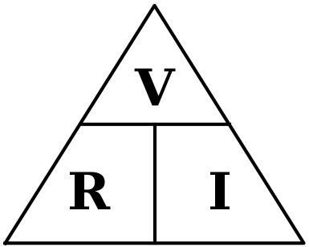

**I (Intensidad de corriente):** Es el flujo de electrones que circula por el conductor. Se mide en Amperes (A).

$$I = \frac{V}{R}$$

Para pasar de A a mA se multiplica por 1000 ($1\text{ A} = 1000\text{ mA}$); para pasar de mA a A se divide por 1000.

**V (Tensión o Voltaje):** Es la fuerza que impulsa a los electrones (la corriente) a través del circuito. Se mide en Volts (V).

$$V = R \cdot I$$

**R (Resistencia):** Es la dificultad u oposición que presenta el material al paso de la corriente eléctrica. Se mide en Ohms ($\Omega$).

$$R = \frac{V}{I}$$

### Analogía hidráulica

Para entender el comportamiento, imagina un circuito como una manguera: la tensión es la presión del agua, la intensidad es el caudal que circula y la resistencia es lo angosta que está la manguera. Por ende, a más presión (más voltaje) habrá más caudal (más corriente); pero si la manguera se estrangula (más resistencia), pasará menos caudal (menos corriente).

### Potencia eléctrica en corriente continua

Es la cantidad de energía transferida por una fuente a un circuito por unidad de tiempo. Por el principio de conservación de la energía, esta energía no se pierde, sino que se transforma en otra manifestation energética.

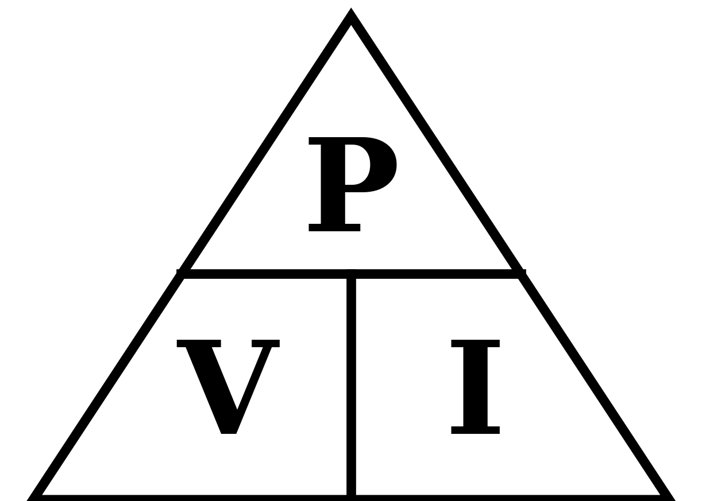

**P (Potencia):** Es la cantidad de energía transferida o transformada. Se mide en Watts (W).

$$P = V \cdot I$$

**V (Tensión o Voltaje):** Es la tensión aplicada al circuito. Se mide en Volts (V).

$$V = \frac{P}{I}$$

**I (Intensidad de corriente):** Es la corriente que circula por el circuito. Se mide en Amperes (A).

$$I = \frac{P}{V}$$

### Explicación del desfase (Por qué se usa esa fórmula)

La fórmula general real de la potencia incluye el desfasaje entre la tensión y la corriente, y es:

$$P = V \cdot I \cdot \cos(\varphi)$$

Sin embargo, en Corriente Continua (CC) ese desfasaje es de $0^{\circ}$. Como el coseno de 0 grados es igual a 1, la fórmula se simplifica directamente a

$$P = V \cdot I$$

---

## Concepto y Análisis de Circuitos

**Circuito Eléctrico:** Es un conjunto de elementos o componentes interconectados (como resistencias, diodos, capacitores, bobinas o pilas) de tal forma que debe haber, al menos, una trayectoria cerrada.

- **Condición de funcionamiento:** El conductor debe formar una trayectoria cerrada para que los electrones puedan fluir. Si se conecta un cable a los dos terminales de una pila, la corriente fluye porque el camino está cerrado (como una pista de carreras completa). Si sólo se conecta un extremo, no hay corriente porque los electrones no tienen hacia dónde ir (como una pista en construcción).
- **Peligro de cortocircuito:** No se debe conectar un alambre directo entre los terminales de una fuente. Como la resistencia es muy baja, se generará una gran corriente que calentará el cable y la pila, corriendo el riesgo de dañar la fuente. Para aprovechar la corriente, siempre se deben incluir componentes que interactúen con ella.

**Nodos:** Se llama nodo al punto de interconexión donde se unen dos o más componentes.

- **Regla de análisis para los Nodos:** Si dos puntos están unidos por conductores perfectos (cables limpios sin ningún componente en el medio), en teoría representan un solo y único punto en el circuito. Considerar que son dos nodos diferentes es un error común; aunque el dibujo cambie la forma de la conexión y los muestre separados, son en realidad un solo punto.

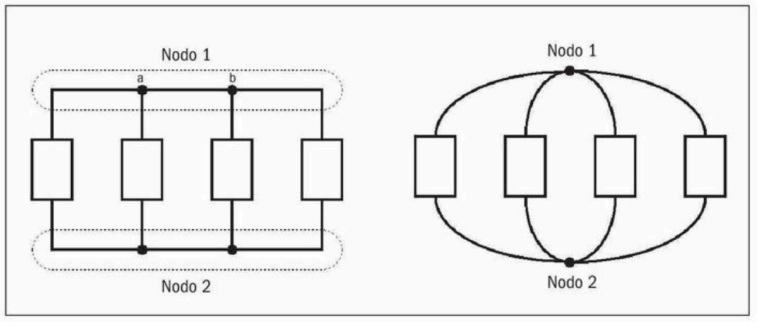

### Circuito eléctrico con resistencias en serie

Las resistencias están conectadas una a continuación de la otra en el circuito eléctrico, de tal forma que la corriente que atraviesa la primera de ellas será la misma que atraviesa las siguientes.

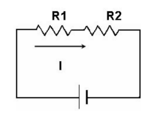

- **$I_t$:** La corriente total es igual en todos los componentes del circuito.
  $$I_t = I_1 = I_2 = \dots = I_n$$
- **$V_t$:** La tensión de la fuente, voltaje total, se reparte entre todas las resistencias.
  $$V_t = V_1 + V_2 + \dots + V_n$$
- **$R_t$:** La resistencia total es la suma directa de los valores de todas las resistencias.
  $$R_t = R_1 + R_2 + \dots + R_n$$

---

### Circuito eléctrico con resistencias en paralelo

Las resistencias están conectadas de tal forma que sus terminales de entrada están unidos entre sí, y sus terminales de salida también, quedando todas conectadas directamente a los mismos dos nodos del circuito.

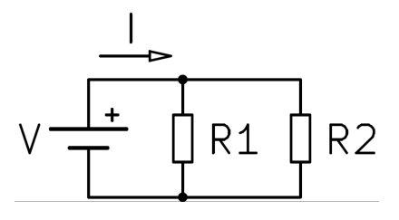

- **$I_t$:** La corriente total se divide entre todos los caminos en paralelo.
  $$I_t = I_1 + I_2 + \dots + I_n$$
- **$V_t$:** El voltaje total es exactamente el mismo en cada una de las resistencias, ya que todas comparten los mismos nodos.
  $$V_t = V_1 = V_2 = \dots = V_n$$
- **$R_t$:** La inversa de la resistencia total es igual a la suma de las inversas de cada una de las resistencias.
  $$\frac{1}{R_t} = \frac{1}{R_1} + \frac{1}{R_2} + \dots + \frac{1}{R_n}$$

O despejada como una sola fracción:

$$R_t = \frac{1}{\frac{1}{R_1} + \frac{1}{R_2} + \dots + \frac{1}{R_n}}$$

---

## Leyes Fundamentales de Circuitos

### Ley de Kirchhoff (Ley de Nodos)

La sumatoria de las corrientes eléctricas que entran y salen de un nodo, dando signo positivo (+) a las que entran y signo negativo (-) a las que salen, es igual a 0 en todo instante de tiempo.

$$\sum_{k=1}^{n} I_k = 0 \Longleftrightarrow \sum I_{\text{entrada}} = \sum I_{\text{salida}}$$

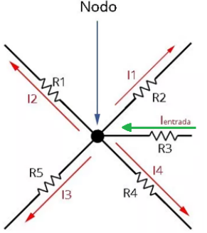

### Ley de Kirchhoff (Ley de Mallas)

La sumatoria de las tensiones a lo largo de un circuito cerrado (malla), dando signo positivo (+) a las subidas de tensión y signo negativo (-) a las caídas de potencial, es igual a 0 en todo instante de tiempo. Esto equivale a decir que la suma de las caídas de potencial es igual a la tensión (fuerza electromotriz) aplicada al mismo.

$$\sum_{k=1}^{n} V_{k}=0 \Longleftrightarrow \sum V_{\text{subidas}} = \sum V_{\text{caidas}}$$

$$V_{\text{total}} - V_1 - V_2 - \dots - V_n = 0 \Longleftrightarrow V_{\text{total}} = V_1 + V_2 + \dots + V_n$$

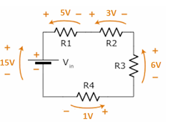

---

## Componentes Pasivos en Corriente Continua

### Condensador o Capacitor

Son componentes que tienen ciertas particularidades especiales. Están compuestos por 2 placas metálicas enfrentadas separadas por un aislante (puede ser mica, el aire, cerámica, etc.) llamado dieléctrico. Tienen la capacidad de almacenar cargas cuando están conectados en un circuito eléctrico de corriente continua.

Se lo identifica con la letra **C**, su característica de almacenar cargas se llama **Capacidad** y se mide en **Faradios (F)**.

**Su símbolo:**

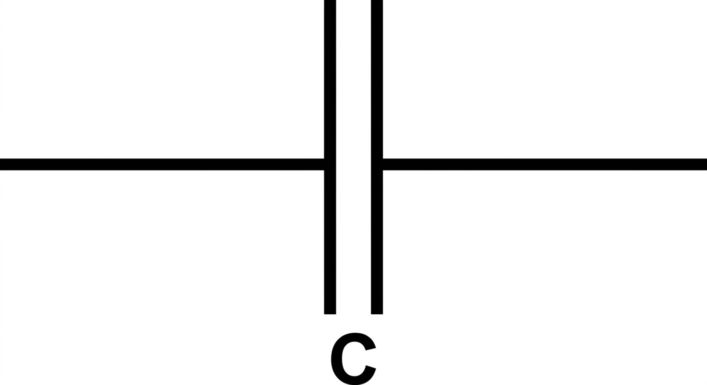

### Comportamiento de un condensador en corriente continua

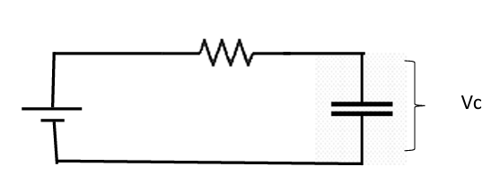
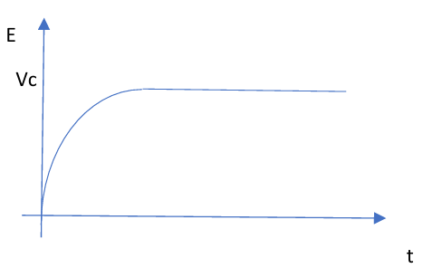

Como se visualiza en el gráfico, la tensión sobre el condensador sube lentamente hasta alcanzar un valor máximo.

- **Analogía hidráulica:** Para entender el comportamiento, imaginate que un capacitor es como un tanque de agua intercalado en la cañería. Al principio, el tanque está vacío y el agua empieza a entrar llenándolo lentamente. A medida que el tanque se va llenando, la presión en el tanque sube despacito hasta que se iguala con la de la red; en ese momento, el tanque se llenó por completo y el agua deja de circular (bloquea el paso de la corriente).

---

### Inductores

También llamados comúnmente bobinas, son elementos eléctricos formados por un conductor arrollado sobre un núcleo no conductor.

**Su símbolo:**

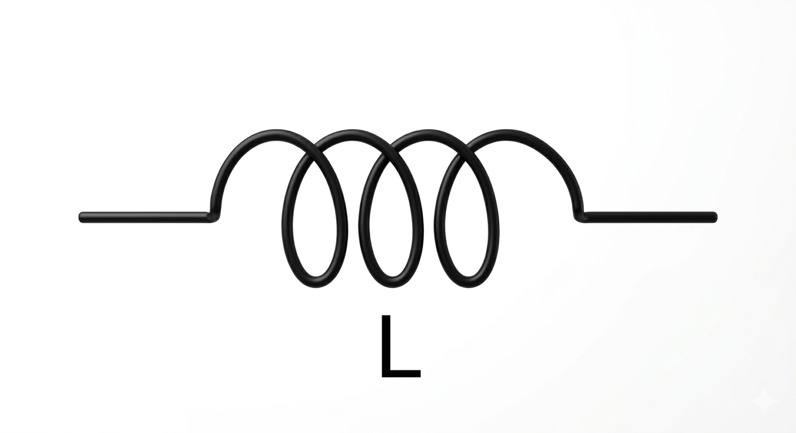

Su comportamiento en corriente continua es acumular energía en forma de corriente eléctrica y una característica muy importante es generar un campo magnético a su alrededor proporcional a la corriente que lo atraviesa. Cuando se quiere quitar esa corriente el inductor responde generando una tensión igual pero de sentido inverso a la que producía la corriente que lo atravesaba. Esta tensión se denomina fuerza contraelectromotriz inducida (Fem). Su valor se mide en **Henrios o Henry** y se lo abrevia con **(H)** o **(Hy)**.

Al decir que genera un campo magnético a su alrededor proporcional al flujo eléctrico que lo atraviesa, se quiere decir que si se le aplica corriente continua, generará un campo magnético continuo.

### Comportamiento de un inductor en corriente continua

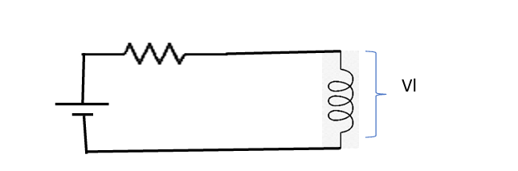
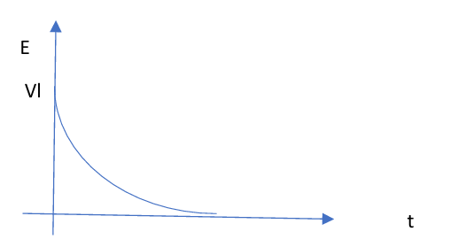

Aquí se puede ver que en un primer instante la tensión crece bruscamente sobre el inductor y luego baja hasta tender a 0 Volts (en un conductor ideal).

- **Analogía hidráulica:** Para entender el inductor, imaginate una rueda de paletas pesada (un molino) metida adentro de la tubería. Al principio, cuando el agua empieza a correr, la rueda está totalmente quieta y ofrece muchísima resistencia para empezar a girar, provocando un gran frenazo de golpe (el pico brusco de tensión). A medida que el agua empuja, la rueda empieza a girar más y más rápido hasta que acompaña el flujo por completo; en ese punto, la rueda ya no frena nada el agua y gira libremente sin oponer resistencia (la tensión cae a 0 Volts).

---

# CORRIENTE ALTERNA Y FILTROS

## Fundamentos de Corriente Alterna

### Corriente Alterna

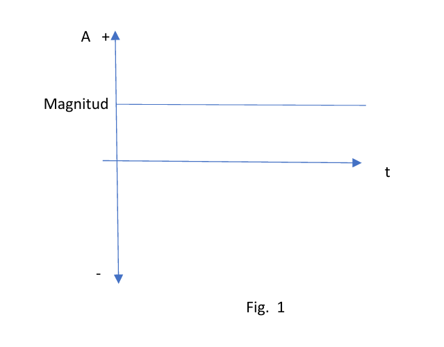

El gráfico cartesiano para definir una tensión o una corriente constante es el siguiente: Donde en A se lleva el valor de la tensión o de la corriente, t es el tiempo que transcurre y magnitud el valor medido en la unidad correspondiente. Se puede ver que la amplitud no varía. Una tensión o corriente continua es aquella que no cambia de signo a través del tiempo. El gráfico de la Fig 1 corresponde a esta definición. Pero los siguientes gráficos también:

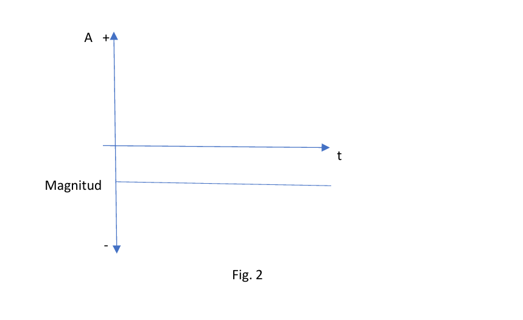
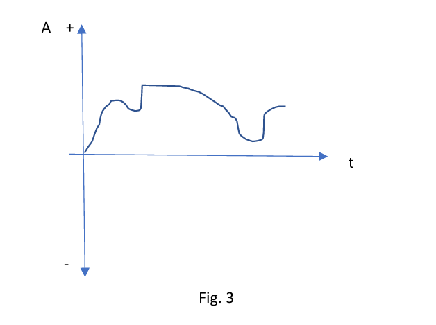

El gráfico de la Fig. 2 respeta la definición. No cambia de signo, es negativa. El gráfico de la Fig 3 también la respeta. No cambia de signo.

Al de la las Fig. 1 y 2 se los denomina **tensión o corriente continua pura**. Al de la Fig 3 se lo denomina **tensión o corriente continua pulsante**. Pero los 3 son de tensión o corriente continua.

Otro caso es el de la Corriente Alterna. Normalmente llamada así, pero se refiere tanto a corriente como a tensión alterna. En este caso el sentido de circulación de la corriente o la aplicación de la tensión cambia de signo:

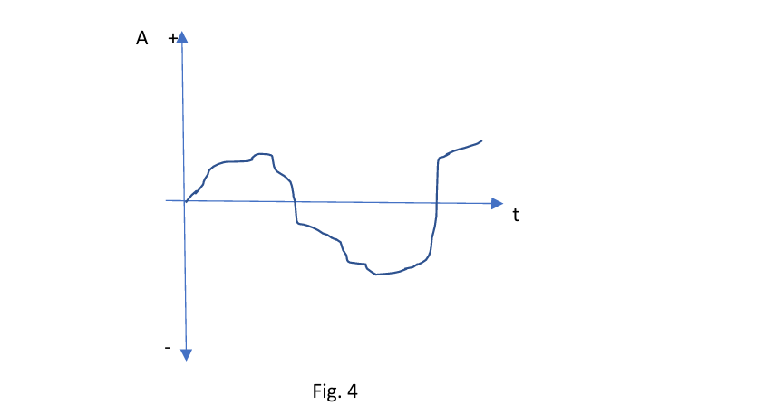

En este caso se ve que el valor de la tensión o corriente cambia de signo. O sea que en un momento la corriente circulará en un sentido y luego en otro, lo cual se refleja en el eje del tiempo.

El caso específico que estudiaremos en esta materia es el de la **corriente alterna senoidal o sinusoidal**. El gráfico puede verse en la siguiente figura:

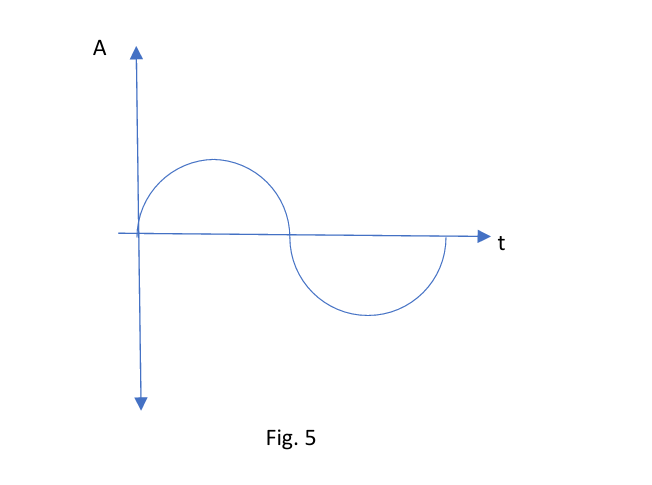

Esta forma de onda surge del círculo trigonométrico donde se reflejan las variaciones de amplitud a través del tiempo que toma la amplitud al ser recorrida y reflejada en un gráfico cartesiano:

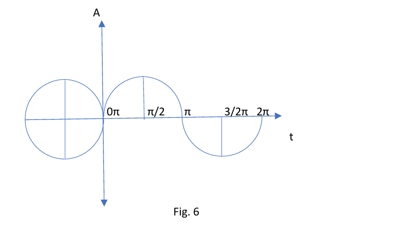

### Propiedades de la Onda Senoidal

Esta onda de tensión y corriente tienen algunas propiedades, algunas de las cuales definiremos a continuación:

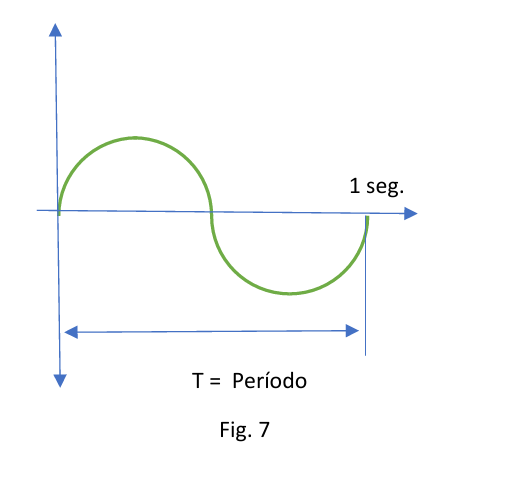

- **Ciclo:** Es el recorrido entre dos puntos iguales de la onda. Se lo enuncia con la letra **c**.
- **Período:** Es el tiempo que se tarda en realizar un ciclo. Se mide en segundos (s) and se enuncia con la letra **T**.
- **Frecuencia:** Es la cantidad de ciclos que se realizan por segundo. Se mide en Hertz (Hz). Un Ciclo por Segundo equivale a 1 Hz. Se la enuncia con la letra **f**.

Estas 3 definiciones (más una que se verá más adelante llamada longitud de onda) son fundamentales en el estudio de señales, lo cual será un pilar importantísimo a lo largo de la carrera.

En el siguiente gráfico se reflejan estas 3 definiciones: En el caso de la Fig. 7, en verde se ve un Ciclo, y el tiempo que tarda en realizarse ($T = \text{período}$) es un segundo. Por lo tanto la Frecuencia es de 1 ciclo por segundo o lo que es lo mismo 1 Hz (Hz).

**Fórmulas:**

$$T = \frac{1}{f}$$

$$f = \frac{1}{T}$$

---

## Comportamiento de Componentes en Alterna

### Reactancia Capacitiva ($X_c$)

Es la "resistencia" que presenta un condensador al paso de la corriente alterna. Se mide en Ohms ($\Omega$). Su fórmula es:

$$|X_C| = \frac{1}{2\pi f C}$$

Donde **f** es la frecuencia en Hertz (Hz) del generador y **C** es el valor del condensador en Faradios (F). Es una magnitud vectorial a $90^{\circ}$ con respecto al eje X.

### Reactancia Inductiva ($X_L$)

Es la "resistencia" que presenta un inductor al paso de la corriente alterna. Se mide en Ohms ($\Omega$). Su fórmula es:

$$|X_L| = 2\pi f L$$

Donde **f** es la frecuencia en Hertz (Hz) del generador y **L** es el valor del inductor en Henrios (H). Es una magnitud vectorial a $90^{\circ}$ en sentido opuesto a $X_c$ _(Nota: La resistencia R en corriente alterna se comporta igual que en continua y su ángulo es $0^{\circ}$ sobre el eje X)._

### Esquema Gráfico de Resistencias

Gráficamente, $R$, $X_C$ y $X_L$ tienen distinta orientación sobre los ejes. Usando a $R$ como referencia a $0^{\circ}$ sobre el eje X, se dibuja a $X_L$ a $90^{\circ}$ hacia arriba y a $X_C$ a $90^{\circ}$ en sentido opuesto (hacia abajo).

#### Resistencia (R)

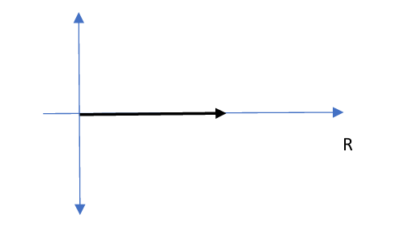

#### Reactancia Capacitiva ($X_c$)

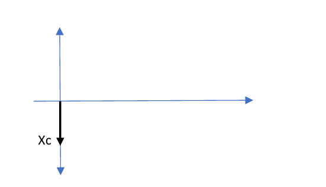

#### Reactancia Inductiva ($X_l$)

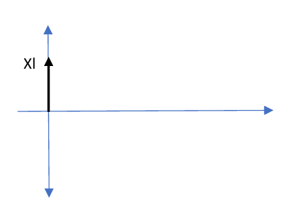

### Desfasaje en Corriente Alterna

Es el ángulo de separación que se produce entre las ondas de tensión y de corriente al atravesar un componente.

**Símbolo del generador:**

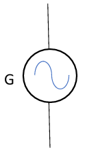

1. **Circuito totalmente resistivo:** La corriente sigue la misma forma de onda que la tensión, por lo que se dice que están en fase. Su corriente es:

   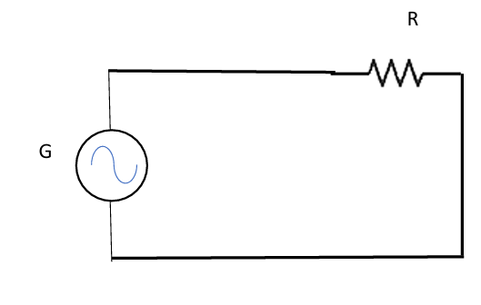
   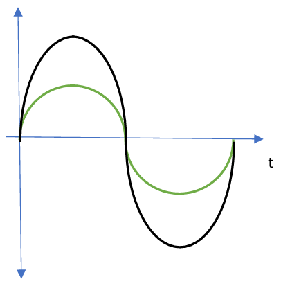

   $$I = \frac{V}{R}$$

2. **Circuito totalmente inductivo:** Las ondas se separan y se dice que la tensión adelanta a la corriente en $90^{\circ}$. Su corriente es:

   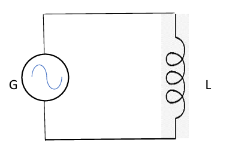
   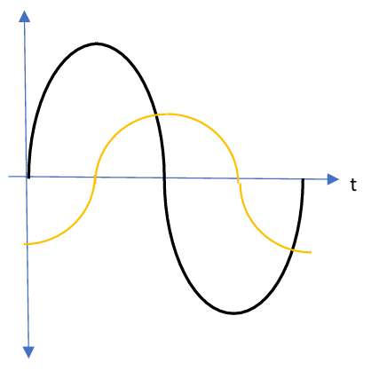

   $$I = \frac{V}{X_L}$$

3. **Circuito totalmente capacitivo:** Las ondas se separan y se dice que la tensión atrasa a la corriente en $90^{\circ}$. Su corriente es:

   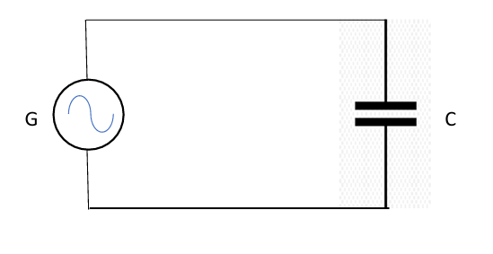
   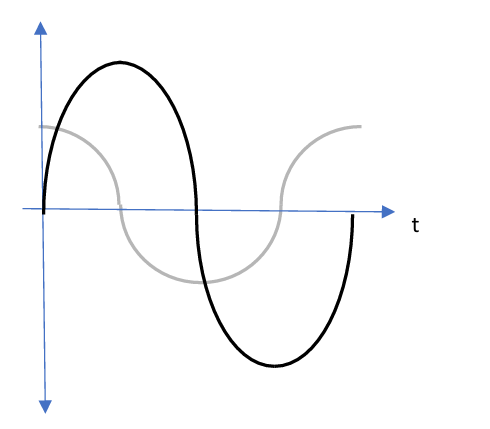

   $$I = \frac{V}{X_C}$$

---

# CIRCUITOS COMPLEJOS Y RESONANCIA

## Circuito RLC Serie

### Pulsación ($\omega$)

En las fórmulas de reactancia figura el término $2\pi f$. A esto se lo llama **pulsación**, se identifica con la letra griega omega ($\omega$) y su unidad es radianes por segundo (rad/s). Permite simplificar las fórmulas anteriores de la siguiente manera:

$$\omega = 2\pi f \Longrightarrow |X_C| = \frac{1}{\omega C} \quad \text{y} \quad |X_L| = \omega L$$

### Definición de Impedancia ($Z$)

Es la resistencia total que un circuito RLC serie presenta al paso de la corriente alterna. Se mide en Ohms ($\Omega$). Al estar los componentes en serie, sus resistencias deben sumarse, pero por ser vectores la suma tiene que ser de forma vectorial (posee módulo y argumento o ángulo $\rho$).

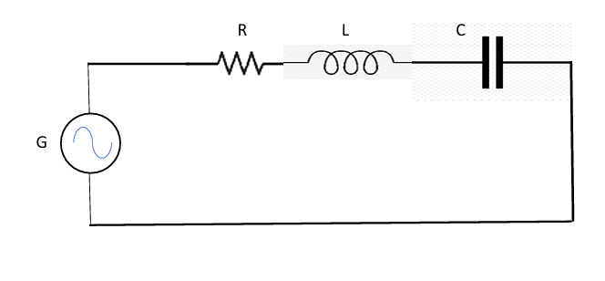

### Suma Geométrica (Gráfica)

Como $X_C$ y $X_L$ están sobre la misma recta de acción pero en sentidos opuestos, primero se restan directamente ($X_L - X_C$). El vector resultante de esa resta se combina a $90^{\circ}$ con la resistencia $R$ para formar la Impedancia ($Z$) y su ángulo de desfasaje ($\rho$).

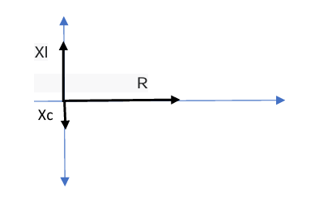
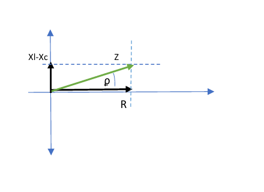

### Suma Analítica (Fórmulas)

- **Módulo de la Impedancia:**
  $$|Z| = \sqrt{R^2 + (X_L - X_C)^2}$$

  $$|Z| = \sqrt{R^2 + \left(2\pi f L - \frac{1}{2\pi f C}\right)^2}$$

- **Ángulo de desfasaje:**
  $$\tan(\rho) = \frac{X_L - X_C}{R} \Longrightarrow \rho = \arctan\left(\frac{X_L - X_C}{R}\right)$$

---

## Frecuencia de Resonancia ($f_0$)

Como $X_L$ y $X_C$ se restan en la fórmula, cuando sus valores sean iguales se anularán entre sí ($X_L = X_C$). Cuando esto ocurre, la impedancia vale únicamente el valor de la resistencia ($Z = R$).

Esto se da a una determinada frecuencia llamada **frecuencia de resonancia ($f_0$)**, medida en Hertz (Hz), y tiene la particularidad de que en ese instante la corriente por el circuito será máxima.

Su fórmula es:

$$f_0 = \frac{1}{2\pi \sqrt{L \cdot C}}$$

## Aplicaciones Técnicas: Filtros

### Filtros

Son circuitos compuestos por componentes pasivos (resistencias, condensadores e inductores) que tienen características selectivas de señales. Esto significa que, según cómo se combinen, permiten el paso de ciertas frecuencias y bloquean otras.

Convengamos a modo de estudio que Rx será el receptor (y cumplirá la función de R) y G será Tx (y cumplirá la función del transmisor).

### 1. Circuito Pasa Altos

Presentará una baja resistencia a las frecuencias altas en un circuito. Se logra conectando un condensador en serie entre el transmisor y el receptor.

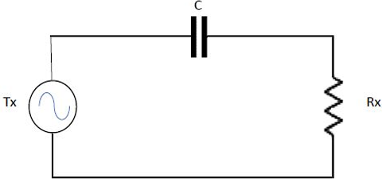

Recordemos la fórmula de $X_C$:

$$X_C = \frac{1}{2\pi f C}$$

Por lo tanto, si $f$ sube, $X_C$ baja y por las leyes vistas la corriente será superior por el circuito y la potencia sobre Rx será mayor.

Por el contrario, si la frecuencia $f$ baja, la reactancia sube y si $f$ tiende a 0, $X_C$ tiende a infinito, lo que significa que se comporta como un circuito abierto. No dejando pasar la señal.

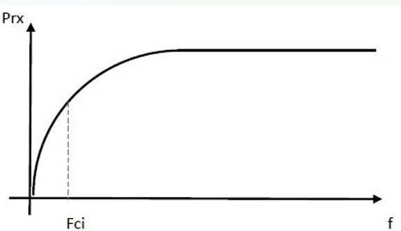

---

### 2. Circuito Pasa Bajos

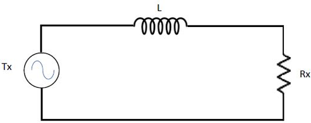

Recordemos la fórmula de $X_L$:

$$X_L = 2\pi f L$$

Por lo tanto, si la frecuencia $f$ es baja, el valor de la reactancia inductiva será muy bajo, casi no oponiendo resistencia al paso de la corriente eléctrica.

Por el contrario, si la frecuencia $f$ sube, el valor de la reactancia inductiva subirá en forma proporcional, llegando a valores muy altos donde se comportará como una gran resistencia no dejando pasar la señal.

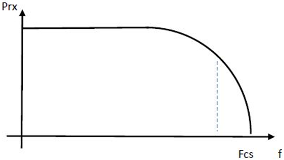

El gráfico muestra la distribución de la potencia de la señal que recibe el receptor a medida que la frecuencia aumenta, cayendo la potencia cuando se supera la frecuencia de corte.

---

### 3. Circuito Pasa Banda

Un circuito RLC serie funciona como un circuito PASA BANDA. Esto significa que habrá una banda pasante que tendrá un conjunto de frecuencias que tendrán menor Impedancia Z, o sea que tendrá menor resistencia al paso de la señal.

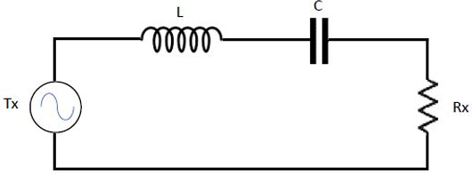

Esa frecuencia será la frecuencia de resonancia, la central, y a sus lados una frecuencia de corte inferior fci y una de corte superior fcs. Fuera de esos límites se considera que las otras frecuencias están bloqueadas.

Al conjunto de frecuencias entre la fci y la fcs se la llama ancho de banda (AB). El ancho de banda es el conjunto de frecuencias donde radica la mayor parte de la potencia de la señal y se calcula como el ancho de banda es igual a:

$$AB = f_{cs} - f_{ci}$$

La línea que marca -3 _ D _ B es la única línea que indica que la señal está a mitad de la pendiente.

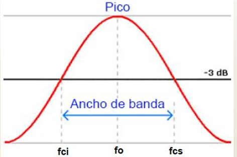

$$\vert Z \vert = \sqrt{R^2 + \left(2\pi f L - \frac{1}{2\pi f C}\right)^2}$$

---

### Frecuencia de Resonancia

La frecuencia de resonancia $f_0$ es donde la transferencia de energía es máxima hacia R (Rx o carga) en una línea de transmisión que se asemeja a un circuito RLC serie. Eso se dará a cierta frecuencia y esa frecuencia será llamada “frecuencia de resonancia” $f_0$, medida en Hertz (Hz), y tiene la particularidad que en ese caso la corriente por el circuito será máxima.

La fórmula para calcular esa frecuencia es:

$$f_0 = \frac{1}{2\pi \sqrt{L \cdot C}}$$
